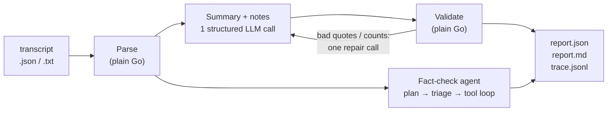

# Podcast Agent

An AI agent that turns raw podcast transcripts into publish-ready show notes for an ad agency. For each episode it writes:

1. A **summary** of 200–300 words.
2. **Show notes**: 5 key takeaways, notable quotes with timestamps, and topic tags.
3. A **fact-check** of the claims made on air. Each claim is marked ✅ verified, ⚠ possibly outdated/inaccurate or ❓ unverifiable, with evidence links and a confidence score.

It's written in Go and calls Claude through the Anthropic API by default; OpenAI and local Ollama models are also supported, and Amazon Bedrock is wired in but can't run the current model yet ([why](#assumptions-and-limitations)). It runs from the command line or in Docker, and in production it runs as a queue worker on AWS: upload a transcript to S3 and the report appears next to it.

| | |
|---|---|
| **Example outputs** | [`results/`](results/): `report.md`, `report.json` and the agent trace for each of the three sample episodes |
| **Deployment strategy** | [`docs/DEPLOYMENT.md`](docs/DEPLOYMENT.md): architecture diagram plus deployment, scaling, fault tolerance, cost, security and more |
| **Assignment** | [`docs/FDE Take Home Assignment.md`](docs/FDE%20Take%20Home%20Assignment.md) |

## Contents

- [Quickstart (Docker)](#quickstart-docker)
- [How it works](#how-it-works)
- [Reading the agent trace](#reading-the-agent-trace)
- [Fact-check method](#fact-check-method)
- [Output](#output)
- [Sample results](#sample-results)
- [Configuration](#configuration)
- [Other ways to run it](#other-ways-to-run-it)
- [Development](#development)
- [Assumptions and limitations](#assumptions-and-limitations)

## Quickstart (Docker)

You need Docker, an [Anthropic API key](https://console.anthropic.com/) and a [Brave Search API key](https://brave.com/search/api/) for live web search. There's no offline mock mode; to run without a key, use a [local model through Ollama](#local-model-ollama-no-api-key).

```bash
git clone https://github.com/Rickyxstar/podcast-agent.git
cd podcast-agent
docker build -t podcast-agent .

cp .env.example .env            # then fill in ANTHROPIC_API_KEY and BRAVE_API_KEY
mkdir -p out
docker run --rm --env-file .env -v "$PWD/out:/out" \
  podcast-agent run samples/ep001_remote_work.json --out /out --pretty
```

Or, without a `.env` file:

```bash
export ANTHROPIC_API_KEY=sk-ant-... BRAVE_API_KEY=...
docker run --rm -e ANTHROPIC_API_KEY -e BRAVE_API_KEY -e SEARCH_PROVIDER=brave -v "$PWD/out:/out" \
  podcast-agent run samples/ep001_remote_work.json --out /out --pretty
```

The readable agent trace is printed to stderr and the Markdown report to stdout. The run takes about a minute and costs about $0.20. Files are written to:

```
out/results/ep001/report.json   # structured output
out/results/ep001/report.md     # the same report for people: summary, notes, fact-check table
out/results/ep001/trace.jsonl   # every agent step, one JSON event per line
```

Notes:

- The three sample transcripts are built into the image under `samples/`. To process your own file, mount it, e.g. `-v "$PWD/my-episode.txt:/in/ep.txt:ro"` and then `run /in/ep.txt`.
- Without `--pretty`, the report is printed as JSON and the trace goes to normal log lines.
- **On Linux**, the container runs as uid 65532. If it can't write to `out/`, add `--user "$(id -u):$(id -g)"`.
- Without a Brave key, set `SEARCH_PROVIDER=kb` (or drop the two Brave flags) and claims are checked against the bundled knowledge base instead of the live web.

## How it works



The summary stage and the fact-check run at the same time, and a failure in one doesn't stop the other.

**1. Parse (no model).** Reads the assignment's JSON shape (`episode_id`, `title`, `host`, `guests`, `transcript[]`) or plain text (`[HH:MM:SS] Speaker: text` or `[MM:SS] Speaker: text`). The text parser handles several entries on one line, lines that wrap, and Windows line endings. The transcript is rendered for the model as `[01:20] Mark [Deep Dive]: …`.

**2. Summary and show notes: one structured call, not an agent.** One call with a JSON schema returns the summary, 5 takeaways, 3–5 quotes and 3–8 topic tags. The order of steps is fixed and nothing needs looking up, so an agent loop would only add cost and variation. The result is then checked in Go:

- Each quote must appear **word for word** in a transcript line, ignoring case, punctuation and curly-vs-straight quotes. The quote's speaker and timestamp are taken from the matching line, not from the model.
- The summary must be 200–300 words, with exactly 5 takeaways, 3–5 quotes and 3–8 topic tags in kebab-case.

If anything fails, the model gets **one** repair request listing each problem (and, for a bad quote, the closest real line). Quotes that still don't match are dropped, and other remaining issues are recorded as warnings in the report.

**3. Fact-check: the agentic part.** The agent decides what to check, how to check it, and when it has enough evidence.

1. **Plan.** One call pulls every claim out of the transcript, labels each as `factual`, `anecdote`, `prediction` or `opinion`, and writes a plan for checking it.
2. **Triage (in code).** Anecdotes and predictions are marked ❓ unverifiable with a stated reason; no source can confirm "we hit break-even in 18 months" or "remote-first companies will dominate". Opinions are left out of the fact-check table. No searches are spent on any of them.
3. **Verify (tool loop).** For the factual claims, the model calls tools until each claim has a verdict:
   - `search_kb` or `search_brave`: the bundled knowledge base, or live web search
   - `get_current_date`: so "launches in early 2026" can be judged as outdated if that date has passed
   - `submit_verdict(claim_id, verdict, evidence_ids, reasoning, self_rating)`: records one verdict

   The model can make several tool calls in one turn; they run in parallel and all results go back together. The loop stops when every claim has a verdict, or after 20 model calls, or at a token budget; any claims still open are marked ❓ with the reason `budget_exhausted`. The system prompt includes today's date and the recording date (or "unknown").

The loop is written directly in this repo rather than taken from an SDK's tool runner. That's what lets the same agent run on Claude, OpenAI or a local Ollama model behind one `llm.Provider` interface ([`internal/llm/provider.go`](internal/llm/provider.go)).

**Model settings (Claude).** The default model is `claude-opus-5-5`, with adaptive thinking and summarized reasoning so the trace can show it. Reasoning effort is `medium` for the summary and `high` for the fact-check. Output is structured with JSON schemas. Prompt caching is on, so each turn of the tool loop re-reads the transcript from cache. The worker checks `stop_reason` before using any reply, and refused requests fall back to another model.

## Reading the agent trace

`--pretty` prints one line per step to stderr. This excerpt is from a run on a local `qwen2.5:7b` through Ollama:

```
📥 Ingest: 19 segments, 06:00 long
🤖 summary call: 868 in / 355 out tokens, 26.1s
🧪 Validation: 3 of 3 quotes found in transcript, 5 takeaways, 84-word summary → 1 problem
🤖 plan call: 1,009 in / 798 out tokens, 1m9.3s
   c1 (factual) "Remote work has evolved a lot in just a few years." → Search for recent studies or articles on the evolution of r…
   …
   c7 (prediction) "Remote-first companies will dominate talent acquisition." → Look for recent trends or forecasts from business publicati…
🧭 Plan: 10 claims → 8 factual, 2 predictions
🔧 Repair: asked for fixes to summary → 0 of 1 fixes accepted
🤖 fact_check call: 1,824 in / 291 out tokens, 8 tool calls, 30.2s
🔎 search_kb {"query":"benefits of documentation in small remote teams"}
   ↳ 2,013 bytes of results
…
```

The same events are saved in `trace.jsonl`, one JSON object per line, all sharing a `trace_id`:

| Event | What it records |
|---|---|
| `ingest` | Segments parsed, episode length |
| `claim` | Each extracted claim with its type and plan for checking it |
| `plan` | Claim counts by type |
| `llm_call` | Stage (`summary`, `plan`, `fact_check`, `repair`), model, stop reason, tool calls, input / output / cached tokens, latency |
| `tool_call` / `tool_result` | Each search or verdict call and the size of its result, or the error |
| `verdict` | Claim, verdict, confidence, evidence cited, the model's reasoning |
| `validation` / `repair` | Quote checks, length and count checks, and what the repair call fixed |
| `done` | Fact-check status, claim count, warnings, total cost and duration |

Example from [`results/ep001/trace.jsonl`](results/ep001/trace.jsonl):

```json
{"event":"claim","id":"c1","type":"factual","claim":"GitLab, Automattic, and Doist have written comprehensive handbooks so employees can find answers without constant guidance.","strategy":"Check the knowledge base first for each company's documentation practices. Then confirm on primary sources: GitLab's public handbook (handbook.gitlab.com), Automattic's published remote-work guides and field guide, and Doist's public remote-work playbook…"}
```

Add `--debug` to also log the model's summarized reasoning for each call.

## Fact-check method

| Verdict | Meaning |
|---|---|
| ✅ `verified` | At least one source supports the claim and is still current |
| ⚠ `outdated_or_inaccurate` | The evidence contradicts the claim, or the claim was true once but isn't any more |
| ❓ `unverifiable` | An anecdote or prediction, or not enough evidence was found |

**Confidence is how sure we are of the verdict**, not how likely the claim is to be true. (The assignment doesn't define it; this is my assumption.) It's computed in code ([`internal/agent/confidence.go`](internal/agent/confidence.go)), not taken from the model:

```
confidence = 0.8 × best_source_quality + 0.2 × model_self_rating
```

- `best_source_quality`: 1.0 for a knowledge-base entry, 0.6 for a web result. The best cited source counts, not the average, so citing an extra weaker source never lowers confidence.
- `model_self_rating`: the model's own 0–1 rating, deliberately given little weight.
- If any cited evidence disagrees with the verdict, confidence is capped at **0.50**.
- Verdicts with no evidence (anecdotes, predictions, claims not checked in time) get a fixed **0.40**.

So a claim verified from the knowledge base scores 0.8–1.0, and one verified from web results alone scores at most 0.68.

**Knowledge base.** [`kb/facts.json`](kb/facts.json) has 23 hand-picked facts covering the sample episodes' subjects (remote-work companies, FDA oversight of AI devices, AI in radiology, telehealth, startup funding), each with source, URL and date. It's a demonstration knowledge base, not a complete reference. For real use, set `SEARCH_PROVIDER=brave` for live web search. The committed sample outputs were made that way.

## Output

`report.json` ([example](results/ep001/report.json)):

```jsonc
{
  "episode":   { "id": "ep001", "title": "...", "host": "...", "guests": ["..."], "duration": "06:00" },
  "summary":   "...",                                        // 200–300 words
  "takeaways": ["...", "...", "...", "...", "..."],          // exactly 5
  "quotes":    [{ "text": "...", "speaker": "Mark", "timestamp": "02:45" }],
  "topics":    ["remote-work", "async-culture"],
  "fact_check": {
    "status": "completed",                                   // completed | partial | failed
    "claims": [{
      "id": "c1", "claim": "...", "speaker": "...", "timestamp": "01:20",
      "type": "factual", "verdict": "verified", "confidence": 0.64,
      "evidence": [{ "source": "...", "url": "...", "date": "...", "snippet": "..." }],
      "reasoning": "..."
    }]
  },
  "run": { "provider": "anthropic", "model": "claude-opus-5-5",
           "tokens": { "input": 16, "output": 5057, "cache_read": 8785, "cache_write": 17761 },
           "cost_usd": 0.19, "duration_ms": 41501, "trace_id": "d3ff19913d7555ae", "warnings": [] }
}
```

`report.md` ([example](results/ep001/report.md)) shows the same content for people: the summary, 🔹 takeaways, 💬 quotes with timestamps, 🧭 topic tags, and a fact-check table (claim, verdict, confidence, evidence links).

## Sample results

All three provided transcripts were run with live web search (Brave). Reports and traces are committed in [`results/`](results/).

| Episode | Model | Claims (factual / prediction / anecdote / opinion) | ✅ | ⚠ | ❓ | Cost | Time |
|---|---|---|---|---|---|---|---|
| [ep001 remote work](results/ep001/report.md) | Claude Opus 5.5 | 12 (2 / 3 / 0 / 7) | 2 | 0 | 3 | $0.19 | 42 s |
| [ep002 AI in healthcare](results/ep002/report.md) | gpt-6.1-sol | 30 (20 / 5 / 0 / 5) | 20 | 0 | 5 | $0.29 | 3 min 45 s |
| [ep003 bootstrapping](results/ep003/report.md) | gpt-6.1-sol | 22 (12 / 0 / 7 / 3) | 6 | 1 | 12 | $0.22 | 2 min 26 s |

The ✅ / ⚠ / ❓ counts are rows in the published table, so opinions aren't included. ep002 and ep003 were run on OpenAI to show that the same agent works across providers.

## Configuration

Each setting can be given as a flag or an environment variable. `podcast-agent --help` lists them all.

| Env var | Flag | Default | Purpose |
|---|---|---|---|
| `LLM_PROVIDER` | `--llm` | `anthropic` | `anthropic`, `bedrock`, `openai` or `ollama` |
| `LLM_MODEL` | `--model` | per provider | `claude-opus-5-5`, `anthropic.claude-opus-5-5` (Bedrock), `gpt-6.1-sol`, `qwen2.5:7b` |
| `ANTHROPIC_API_KEY` | | | Anthropic provider |
| `OPENAI_API_KEY` | | | OpenAI provider |
| `OLLAMA_HOST` | `--ollama-host` | `http://localhost:11434` | Ollama provider |
| `AWS_REGION` | `--aws-region` | | Bedrock, S3 and SQS. AWS credentials come from the standard AWS credential chain. |
| `SEARCH_PROVIDER` | `--search` | `kb` | `kb` (bundled knowledge base) or `brave` (web search) |
| `BRAVE_API_KEY` | | | Brave search |
| `KB_DIR` | `--kb-dir` | `kb` | Folder of knowledge-base `*.json` files |
| `STORAGE` | `--storage` | `disk` | Where reports are written: `disk` or `s3` |
| `OUT_DIR` | `--out` | `.` | Root folder for disk storage; reports go to `<out>/results/<episode>/` |
| `S3_BUCKET` | `--bucket` | | Bucket for S3 storage |
| `AWS_ENDPOINT_URL` | `--s3-endpoint` | | S3 endpoint override, e.g. LocalStack |
| `SQS_QUEUE_URL` | `--queue-url` | | `worker` only: queue to consume |
| `WORKER_CONCURRENCY` | `--concurrency` | `2` | `worker` only: episodes processed at once per process |
| `TIMEOUT` | `--timeout` | `10m` | Time limit for each episode |
| `DEBUG` | `--debug` | off | Debug logs, including the model's summarized reasoning |

## Other ways to run it

### Without Docker

Requires Go 1.27+.

```bash
set -a; . ./.env; set +a        # or: export ANTHROPIC_API_KEY=sk-ant-... BRAVE_API_KEY=... SEARCH_PROVIDER=brave
go run ./cmd/podcast-agent run samples/ep002_ai_healthcare.json --pretty
# → results/ep002/{report.json,report.md,trace.jsonl}
```

### Local model (Ollama, no API key)

```bash
ollama pull qwen2.5:7b
docker run --rm -e LLM_PROVIDER=ollama -e OLLAMA_HOST=http://host.docker.internal:11434 \
  -v "$PWD/out:/out" podcast-agent run samples/ep001_remote_work.json --out /out --pretty
```

Everything runs on your machine, but expect lower quality. In the trace excerpt above, `qwen2.5:7b` wrote an 84-word summary (the target is 200–300), didn't fix it when asked, and labelled opinions such as "culture is more important than tools" as factual claims, then marked them ✅ at 0.98 confidence by citing loosely related knowledge-base entries. The validation step catches the length problem and records it as a warning; the misjudged claims aren't caught (see [limitations](#assumptions-and-limitations)).

### Other providers

```bash
-e LLM_PROVIDER=openai  -e OPENAI_API_KEY=...                     # gpt-6.1-sol
-e LLM_PROVIDER=bedrock -e AWS_REGION=us-east-1 \
  -e AWS_ACCESS_KEY_ID -e AWS_SECRET_ACCESS_KEY -e AWS_SESSION_TOKEN  # Claude on Amazon Bedrock
```

Bedrock currently fails with Claude Opus 5.5 because it doesn't accept structured outputs for that model; see [limitations](#assumptions-and-limitations).

### Queue worker against LocalStack (the AWS pipeline, locally)

`docker compose` starts LocalStack (S3 + SQS, set up by [`deploy/localstack/init.sh`](deploy/localstack/init.sh) the same way as the Terraform) and the worker. Uploading a transcript to `incoming/` triggers it, exactly as on AWS. The LLM is still a real provider.

```bash
cp .env.example .env                            # fill in the keys; compose reads .env itself
make local-up                                   # start LocalStack + worker
make demo-local                                 # upload ep001, wait, print the report from S3
make demo-local SAMPLE=ep003_bootstrapping.json
make local-logs                                 # follow the worker
make local-down
```

The worker long-polls SQS and extends a message's visibility while an episode runs. It skips uploads it has already processed (same S3 key and ETag), deletes a message only after the report is saved, and on SIGTERM finishes its in-flight episodes before exiting. A file that fails three times moves to the dead-letter queue.

### AWS (EKS)

```bash
cp deploy/terraform/terraform.tfvars.example deploy/terraform/terraform.tfvars
terraform -chdir=deploy/terraform init && terraform -chdir=deploy/terraform apply
eval "$(terraform -chdir=deploy/terraform output -raw kubeconfig_command)"
kubectl create namespace podcast-agent
kubectl -n podcast-agent create secret generic anthropic-api-key --from-literal=ANTHROPIC_API_KEY="$ANTHROPIC_API_KEY"
kubectl -n podcast-agent create secret generic brave-api-key --from-literal=BRAVE_API_KEY="$BRAVE_API_KEY"
make docker push deploy
aws s3 cp samples/ep001_remote_work.json "s3://$(terraform -chdir=deploy/terraform output -raw bucket)/incoming/"
make destroy
```

See [`docs/DEPLOYMENT.md`](docs/DEPLOYMENT.md) for the architecture and how it handles deployment, scaling, failures, cost and security.

## Development

```bash
go test ./...      # unit tests; providers and AWS calls are faked, no keys needed
go vet ./...
make build         # → bin/podcast-agent
```

```
cmd/podcast-agent/      CLI: `run <file>` and `worker` (SQS)
internal/transcript/    JSON and text transcript parsers
internal/agent/         pipeline: summary stage, fact-check agent, tools, validation, repair, confidence, pricing
internal/llm/           provider interface + anthropic, bedrock, openai, ollama, mock
internal/search/        search interface + kb, brave, mock
internal/storage/       storage interface + disk, s3, mock
internal/queue/sqs/     SQS consumer (heartbeat, ack on success) and S3 event parsing
internal/report/        report types, JSON and Markdown rendering
internal/trace/         trace events, JSONL recorder, --pretty printer
kb/                     knowledge base
samples/                the provided transcripts
results/                committed example outputs
deploy/terraform/       AWS: VPC, EKS, ECR, S3, SQS + DLQ, IAM / Pod Identity, KEDA, alarms
deploy/helm/            worker Deployment, KEDA ScaledObject, PDB
deploy/localstack/      LocalStack setup script
```

## Assumptions and limitations

- **Confidence means confidence in the verdict** (see [Fact-check method](#fact-check-method)). Web results all count as 0.6 for now; grading them by domain (official site 0.9, reputable news 0.7) is a TODO, so web-only verdicts currently top out at 0.68. The formula scores *where* evidence came from, not how closely it matches the claim, so a weak model that cites a loosely related knowledge-base entry still gets a high score. A relevance check on each cited source (e.g. a second model pass) is the next fix.
- **Recording date.** The sample transcripts don't include one, so claims are judged against today's date and the prompt says the recording date is unknown. Claims about the future that have since passed can therefore show up as ⚠.
- **Claim types depend on the model.** Claude marked most of ep001's statements as opinions; a 7B local model called them factual. Opinions are left out of the published table, so the table's size varies by model.
- **Not built yet:** removing filler words ("um", "you know") before the text goes to the model, and mapping speaker labels to full names (`Mark` → `Mark Rivera (guest)`) in code. Large models handle both well from the raw transcript. Quotes are always checked against the raw text.
- **No golden-answer evaluation set.** Quality is checked by validation at run time and by unit tests with scripted model responses. The next step would be a `make eval` set of expected verdicts per episode, run on every prompt change.
- **The worker has no `/healthz` or `/metrics` endpoint yet.** The Helm chart's probes are ready but switched off.
- **Reports are drafts.** Anything marked ⚠ or ❓ should be reviewed by a person before it's published.
- **The AWS deployment uses the Anthropic API, not Bedrock.** Bedrock was the plan, so that transcripts would stay inside the AWS account with no API key to manage. But the summary stage relies on structured outputs and the fact-check tools are `strict`, and for Claude Opus 5.5 Bedrock rejects both (tested October 2026, on both the Mantle and `bedrock-runtime` endpoints). The worker therefore calls the Anthropic API with a key from a Kubernetes Secret. The `bedrock` provider is still in the code, so once AWS adds support, moving back only takes the worker's Bedrock IAM permission and a Helm value. [DEPLOYMENT.md](docs/DEPLOYMENT.md#deployment) lists the alternatives.
