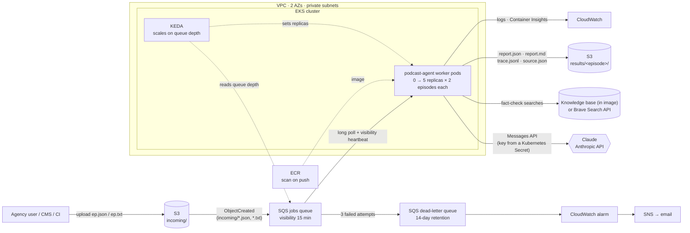
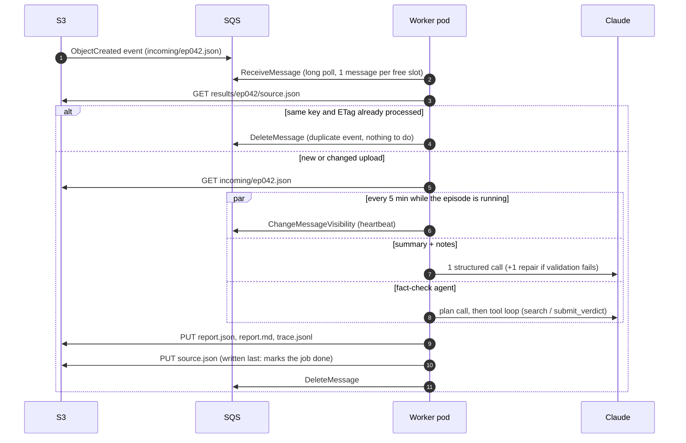

# Deployment Strategy

How the podcast agent runs in production for an ad agency: an account team drops a transcript into S3, and a few minutes later a report with the summary, show notes and fact-check is waiting next to it. No one has to start a job, and no server sits idle waiting for one.

Everything here is implemented as code in this repo: Terraform in [`deploy/terraform`](../deploy/terraform), a Helm chart in [`deploy/helm/podcast-agent`](../deploy/helm/podcast-agent), and a LocalStack version of the same pipeline in [`docker-compose.yml`](../docker-compose.yml). [What's built vs. designed](#whats-built-vs-designed) at the end lists the parts that are design only.

## Architecture



<details>
<summary>Plain-text version</summary>

```
 upload ──► S3 incoming/ ──ObjectCreated──► SQS jobs ──3 failures──► DLQ ──► alarm ──► email
                                              │
            ┌──────────────── EKS (2 AZs) ────┼────────────────────────────────┐
            │  KEDA: replicas = queue depth/2 ▼                                │
            │       worker pods (0–5, 2 episodes each) ──► Claude (Anthropic API)
            │                     │           └────────► KB / Brave search    │
            └─────────────────────┼──────────────────────────────────────────┘
                                  ▼
            S3 results/<episode>/{report.json, report.md, trace.jsonl, source.json}
```

</details>

### One episode, start to finish



**Why a queue between S3 and the workers** (instead of S3 → Lambda, or S3 → a pod directly):

- **It absorbs bursts.** An agency often uploads a whole season at once. The queue holds 50 episodes as easily as one, and workers drain it at the rate the LLM allows.
- **Retries come for free.** A worker deletes the message only after the report is saved. If the pod crashes, the message reappears and another pod picks it up. After three failures it moves to the dead-letter queue (DLQ) and raises an alarm instead of disappearing.
- **It gives the right scaling signal.** Each episode spends most of its time waiting on the LLM, so CPU stays flat whether a pod is busy or idle. Queue depth is what actually tracks the backlog.
- **Results can't trigger new jobs.** Only `incoming/` sends events. Reports are written to `results/`, so the worker can't set itself off.

## Deployment

| Layer          | Tool                                                               | What it creates                                                                                                                                                                                                                                                                                 |
| -------------- | ------------------------------------------------------------------ | ----------------------------------------------------------------------------------------------------------------------------------------------------------------------------------------------------------------------------------------------------------------------------------------------- |
| Infrastructure | Terraform ([`deploy/terraform`](../deploy/terraform))              | VPC (2 AZs, private subnets, one NAT gateway), EKS cluster with a managed node group, ECR repository, S3 bucket, SQS queue + DLQ, the S3 → SQS notification, IAM roles bound to pods with EKS Pod Identity, KEDA, the CloudWatch observability add-on, the DLQ alarm, SNS alerts, an AWS budget |
| Application    | Helm ([`deploy/helm/podcast-agent`](../deploy/helm/podcast-agent)) | Worker Deployment, KEDA `ScaledObject` + `TriggerAuthentication`, ServiceAccount, ConfigMap, PodDisruptionBudget                                                                                                                                                                                |
| Image          | `Dockerfile`                                                       | Static Go binary on distroless, running as a non-root user; the knowledge base is baked in                                                                                                                                                                                                      |

```bash
cp deploy/terraform/terraform.tfvars.example deploy/terraform/terraform.tfvars   # set region, alert_email
terraform -chdir=deploy/terraform init
terraform -chdir=deploy/terraform apply        # ~15–20 min, mostly the EKS control plane

# API keys, once per cluster, before the first deploy
eval "$(terraform -chdir=deploy/terraform output -raw kubeconfig_command)"   # point kubectl at the cluster
kubectl create namespace podcast-agent
kubectl -n podcast-agent create secret generic anthropic-api-key --from-literal=ANTHROPIC_API_KEY="$ANTHROPIC_API_KEY"
kubectl -n podcast-agent create secret generic brave-api-key --from-literal=BRAVE_API_KEY="$BRAVE_API_KEY"

make docker push deploy                        # build for linux/arm64, push to ECR, helm upgrade --install
aws s3 cp samples/ep001_remote_work.json "s3://$(terraform -chdir=deploy/terraform output -raw bucket)/incoming/"
make destroy                                   # helm uninstall, then terraform destroy
```

`make deploy` reads the bucket, queue URL, region and ECR URL from Terraform outputs, so the Helm values never fall out of step with the infrastructure. The API keys are the one manual step: they're Kubernetes Secrets created with `kubectl`, so they never pass through Terraform state, Helm values or the repo. The chart injects them into the worker as `ANTHROPIC_API_KEY` and `BRAVE_API_KEY`. If a pod starts before its Secret exists, it waits in `CreateContainerConfigError` and starts as soon as the Secret is created. To rotate a key, recreate the Secret and run `kubectl -n podcast-agent rollout restart deploy/podcast-agent`.

**How the LLM is reached.** Workers call Claude through the Anthropic API, with the key from the `anthropic-api-key` Secret. The worker's IAM role has no LLM permissions.

**Why not Bedrock.** Bedrock was the original plan: there's no API key to store or rotate, and transcripts stay inside the AWS account, which matters when they hold client material that hasn't been released yet. It doesn't work with this agent today. The summary stage relies on structured outputs (`output_config.format`) and the fact-check tools are `strict`. For Claude Opus 5.5, Bedrock rejects both with `Extra inputs are not permitted`, on the Mantle endpoint the `bedrock` provider uses and on `bedrock-runtime` (tested October 2026). AWS documents structured outputs only on `bedrock-runtime`, and only for Claude Sonnet 4.5, Haiku 4.5, Opus 4.5 and Opus 4.6. The cost of this concession is that transcripts leave the AWS account for Anthropic's API.

Ways back to Bedrock, in order of preference:

1. Re-test when AWS adds structured outputs for newer Claude models. The Go `bedrock` provider is ready. The deployment would need `bedrock-mantle:CreateInference` added back to the worker's IAM role, and `llm.provider: bedrock` in the Helm values. Mantle serves Opus 5.5 only in `us-east-1` and `ap-southeast-4`, so pick `region` to match.
2. Use Opus 4.6 on `bedrock-runtime`. This means a lower-quality model, plus a small provider change: the SDK's `bedrock-runtime` client instead of the Mantle client.
3. Drop schema enforcement on Bedrock and rely on the existing validation and repair step to catch malformed output. This is the least reliable option.

Switching between providers is a config change (`LLM_PROVIDER`), not a code change. The agent calls models through a provider interface that also supports OpenAI and local Ollama models.

**In production** I'd add a CI pipeline (GitHub Actions: test → build → push an image tagged with the git SHA → `helm upgrade`), keep separate `values-<env>.yaml` files for staging and prod, and replace the demo's mutable `latest` tag with SHA tags.

## Scalability

- **Workers scale with the queue.** KEDA aims for 2 messages per pod (`queueLength: 2`), matching each pod's concurrency (`WORKER_CONCURRENCY=2`). It counts messages already being worked on, so it won't remove a pod that's mid-episode. Production values would scale to zero when the queue is empty; the demo keeps one warm pod.
- **Current ceiling.** 5 replicas × 2 episodes = 10 episodes at once. A 6-minute sample episode takes 40 s to 4 min end to end depending on the model, so that's roughly 150–900 episodes an hour.
- **The real limit is the LLM, not the cluster.** Each pod uses about 100m CPU and under 128 MiB of memory, so raising `maxReplicas` is cheap. What matters is staying under the organization's Anthropic API rate limits, so the replica cap is set from those limits, not from cluster size. Rate-limit errors (429) are retried with backoff, and anything that still fails goes back on the queue.
- **S3 and SQS scale on their own.** There's no database to size.
- **Large backfills.** To process a back catalogue overnight, Anthropic's Message Batches API costs half as much and runs outside the interactive rate limits. It doesn't suit the fact-check tool loop, but it does suit the summary stage.
- **Long episodes.** Sample episodes are about 6 minutes, a few thousand tokens each. A 90-minute episode is ~20–25k tokens, still a small fraction of the model's context window, so the pipeline doesn't need to split transcripts into chunks.

## Fault tolerance

| What fails                                                          | What happens                                                                                                                                                                                                                                                |
| ------------------------------------------------------------------- | ----------------------------------------------------------------------------------------------------------------------------------------------------------------------------------------------------------------------------------------------------------- |
| Worker pod crashes or its node dies mid-episode                     | The message was never deleted, so it reappears after the visibility timeout (15 min) and another pod reprocesses it.                                                                                                                                        |
| Pod is shut down normally (scale-in, deploy, node drain)            | On SIGTERM the worker stops taking new messages and finishes the episodes it has. It gets up to 10 minutes (`terminationGracePeriodSeconds: 600`, equal to the per-episode timeout). The PodDisruptionBudget lets a drain remove only one worker at a time. |
| Long episode outlasts the visibility timeout                        | A heartbeat extends the message's visibility every third of the timeout while the episode runs, so a second pod never picks up the same episode.                                                                                                            |
| Same upload delivered twice (S3 and SQS both deliver at least once) | `results/<episode>/source.json` records the S3 key and ETag of the upload that produced the report, and is written last. A redelivery with the same ETag is acknowledged and skipped; a changed file is reprocessed.                                        |
| LLM API returns 429 / 5xx                                           | The SDK retries with exponential backoff. If the call still fails the episode fails, the message returns to the queue, and SQS tries again later.                                                                                                           |
| LLM refuses a request                                               | Through the Anthropic API, the request is retried server-side on a fallback model. On Bedrock, the worker retries client-side on `claude-opus-4-8`.                                                                                                         |
| Fact-check fails but the summary succeeds                           | The report is still written, with `fact_check.status` set to `partial` or `failed` and the error under `run.warnings`. The summary and show notes aren't held back by a search outage.                                                                      |
| Summary fails                                                       | Without a summary there's nothing worth publishing, so the job fails and the message is retried.                                                                                                                                                            |
| Bad file (corrupt, unparseable, refused every time)                 | After 3 attempts the message moves to the DLQ, which holds it for 14 days. The CloudWatch alarm emails the team. After a fix, `aws sqs start-message-move-task` sends the messages back to the main queue.                                                  |
| Agent loops without finishing                                       | The tool loop is capped at 20 model calls, and the whole episode at `TIMEOUT` (10 min). Claims still open at the cap are marked ❓ unverifiable with the reason `budget_exhausted`.                                                                         |
| An Availability Zone goes down                                      | The node group spans 2 AZs. S3 and SQS store data across AZs.                                                                                                                                                                                               |
| LLM provider outage                                                 | Messages wait in the queue (4-day retention) and are processed once the provider is back. To keep going during the outage, switch to OpenAI (`LLM_PROVIDER=openai`), which runs the same agent. Bedrock can't stand in until it supports structured outputs for Opus 5.5. |

## Cost

Approximate on-demand list prices in `us-west-2`, demo-sized cluster:

| Item                                           | Monthly     |
| ---------------------------------------------- | ----------- |
| EKS control plane ($0.10/h)                    | ~$73        |
| 2 × t4g.medium nodes (Graviton)                | ~$49        |
| NAT gateway (one, shared by both AZs)          | ~$33 + data |
| S3, SQS, ECR, CloudWatch Logs at agency volume | < $5        |
| **Fixed infrastructure**                       | **~$160**   |

LLM cost per episode, measured on the sample runs and reported in each report's `run.cost_usd`:

| Episode (~6 min)                   | Model           | Cost  | Wall time  |
| ---------------------------------- | --------------- | ----- | ---------- |
| ep001 remote work (12 claims)      | Claude Opus 5.5 | $0.19 | 42 s       |
| ep002 AI in healthcare (30 claims) | gpt-6.1-sol     | $0.29 | 3 min 45 s |
| ep003 bootstrapping (22 claims)    | gpt-6.1-sol     | $0.22 | 2 min 26 s |

At 1,000 episodes a month that's roughly $200–300 in LLM costs on top of the ~$160 for infrastructure. Cost rises with the number of factual claims more than with episode length.

**Cost controls already in place:**

- Prompt caching: the transcript and conversation history are cached, so each turn of the tool loop re-reads them at about a tenth of the normal input price instead of paying for them again. On ep001, only 16 input tokens were billed at the full rate; the rest were cache writes (17.8k) and cache reads (8.8k).
- Claims that are opinions, predictions or anecdotes are marked in code without any searches or model calls.
- Reasoning effort is set per stage: `medium` for the summary, `high` only for the fact-check.
- Every report records its own token use and cost, so spending can be tracked per episode and per client.
- An AWS Budgets alert at 80% of the monthly limit (forecast alert at 100%), plus `force_destroy` so a demo environment tears down cleanly.
- Graviton (arm64) nodes, and one NAT gateway instead of one per AZ.

**Next cost levers:**

- Use a cheaper model (e.g. Claude Haiku 4.5 at $1/$5 per million tokens) for claim extraction and the summary, keeping the strong model for verdicts. This is a quality trade-off and should be measured before switching.
- Use the Batch API for backfills (half price).
- Add Karpenter or Cluster Autoscaler so nodes, not just pods, scale to zero overnight.
- Use Fargate for the worker pods.

## Security

- **No static AWS credentials anywhere.** Worker and KEDA pods get short-lived credentials through EKS Pod Identity, each bound to its own namespace and service account.
- **Least-privilege IAM.** The worker can read `incoming/*`; read and write `results/*`; and receive, delete and extend messages on its own queue. Nothing else. KEDA can read queue depth only.
- **Data at rest.** S3 uses server-side encryption, versioning and a full public-access block. Both queues use SQS-managed encryption.
- **Containers.** Distroless base image (no shell), non-root user 65532, read-only root filesystem, all Linux capabilities dropped, `RuntimeDefault` seccomp, no privilege escalation. ECR scans each image on push.
- **Secrets.** The Anthropic and Brave keys are Kubernetes Secrets, injected as environment variables, never baked into the image or committed. For production I'd turn on EKS envelope encryption of Secrets with a KMS key, and sync the keys from AWS Secrets Manager with the External Secrets Operator so they can be rotated centrally. Moving to Bedrock would remove the LLM key entirely (see [Why not Bedrock](#deployment)).
- **Prompt injection.** Transcripts are untrusted input. The agent's tools are read-only (search, get the date, record a verdict), so a transcript that tries to hijack the model can at most skew its own report. It can't reach other data or take actions. Quotes are checked word for word against the transcript in code, and confidence scores are computed in code rather than taken from the model.
- **Before going to production** I'd make the EKS API endpoint private (or limit it to a CIDR allowlist), use one KMS key per client, and turn on S3 access logging.

## Observability

- **Logs.** Workers write structured `slog` logs tagged with `trace_id` and `episode`. The CloudWatch observability add-on (Fluent Bit + Container Insights) ships them, with pod and node metrics, to CloudWatch.
- **An agent trace for every episode.** `results/<episode>/trace.jsonl` records each step: ingest, plan, each claim with its strategy, every model call (tokens, stop reason, latency), tool calls and results, verdicts, validation and repairs, and the final cost. It's the first thing to open when someone asks why a claim got the verdict it did.
- **Run metadata in every report.** `run` holds the provider, model, tokens, cost, duration, trace ID and warnings.
- **Alerts.** Email when the DLQ is non-empty and when the budget is nearly spent.
- **Next:** a Prometheus `/metrics` endpoint (episodes processed and failed, latency, tokens, cost), a CloudWatch alarm on `ApproximateAgeOfOldestMessage` to catch a stuck backlog, and a dashboard with verdict distribution over time as an early warning of quality drift.

## Disaster recovery

- **Infrastructure:** all of it is code, so a full rebuild (or a move to another region) is `terraform apply` followed by `make docker push deploy`.
- **Workers:** stateless. The queue and the bucket hold all state.
- **Data:** S3 versioning keeps overwritten or deleted reports for 30 days. For regional failure, add S3 cross-region replication of `incoming/` and `results/`.
- **Jobs in flight:** the queue keeps unprocessed episodes for 4 days and the DLQ keeps failed ones for 14 days, so nothing is lost while the system is being repaired.

## Alternatives considered

| Option             | Why it wasn't chosen                                                                                                                                                                                                                                                                                                                                                                                                                                                                                                                          |
| ------------------ | --------------------------------------------------------------------------------------------------------------------------------------------------------------------------------------------------------------------------------------------------------------------------------------------------------------------------------------------------------------------------------------------------------------------------------------------------------------------------------------------------------------------------------------------- |
| **S3 → Lambda**    | Simplest option, and fine for short episodes. But Lambda has a hard 15-minute limit, and a long episode with many claims and a slow LLM can approach it. Concurrency limits, retries and dead-lettering are coarser than with an explicit queue. Lambda would suit a small "enqueue only" function, but here S3 sends events straight to SQS, so even that isn't needed.                                                                                                                                                                      |
| **Step Functions** | Good at fixed, multi-stage workflows with visual history. But the interesting part here, the fact-check, is a model-driven loop whose length isn't known in advance. Expressing that as a state machine adds cost per state transition and splits the logic across two places. The `trace.jsonl` already provides the step-by-step history.                                                                                                                                                                                                   |
| **ECS on Fargate** | A valid, simpler choice for a single service: no nodes and no Kubernetes to run, with SQS-based autoscaling through Application Auto Scaling. I chose EKS because KEDA gives queue-depth scaling with scale-to-zero and awareness of in-flight messages out of the box. It's also portable: the same chart can run self-hosted models (Ollama/vLLM on GPU nodes) next to the workers for clients who can't send transcripts to a hosted LLM. And many agencies already run Kubernetes. With only this one workload, Fargate would be my pick. |
|  |

## What's built vs. designed

| Built in this repo                                                                                                             | Designed only (described above)                                                                                        |
| ------------------------------------------------------------------------------------------------------------------------------ | ---------------------------------------------------------------------------------------------------------------------- |
| Terraform for the full AWS stack: VPC, EKS, ECR, S3, SQS + DLQ, IAM / Pod Identity, KEDA, CloudWatch add-on, DLQ alarm, budget | `/healthz` and Prometheus `/metrics` endpoints (the chart has probes ready, switched off with `health.enabled: false`) |
| Helm chart with KEDA scaling, PDB, hardened security context, config/secret wiring                                             | CI/CD pipeline and per-environment values beyond `values-demo.yaml`                                                    |
| Worker: SQS long poll, visibility heartbeat, idempotency by ETag, graceful SIGTERM drain, partial results                      | Per-client prefixes, KMS keys and cost attribution                                                                     |
| `make docker push deploy destroy`                                                                                              | Slack / review workflow before publishing                                                                              |
| LocalStack copy of the S3 → SQS → worker pipeline (`make local-up demo-local`)                                                 | Cross-region replication, private EKS endpoint, node autoscaling                                                       |
